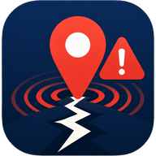
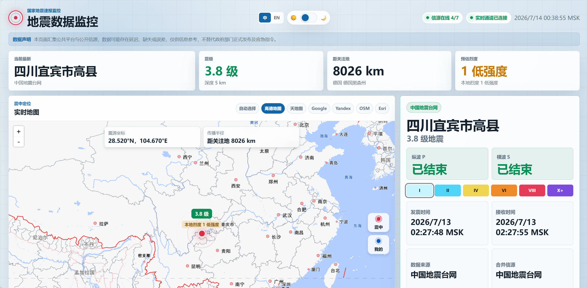
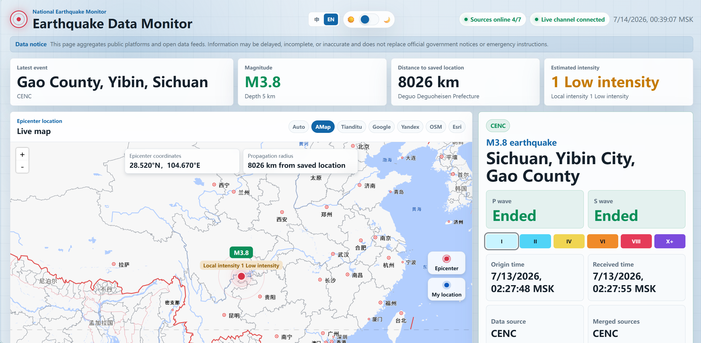
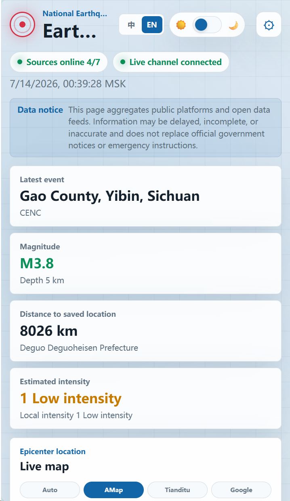
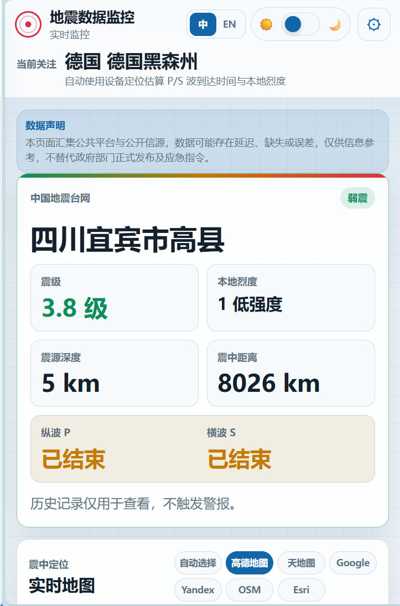

<div align="center">

<p><a href="README_CN.md">Chinese</a> · <strong>English</strong></p>



<h1>Earthquake Live Monitoring System</h1>

<p>Real-time earthquake data dashboard for desktop, mobile, and OBS.</p>

<p>
  <a href="https://github.com/NJyutong/China-Earthquake-Warning/blob/main/LICENSE"></a>
  
  
  
  <a href="https://cnquake.xyz/"></a>
</p>

</div>

---

> This project aggregates public earthquake feeds. Information may be delayed, incomplete, or inaccurate. It is not an official emergency-warning channel and must not be the only source used for life-safety decisions.

## About

The server connects to public earthquake data feeds, normalizes incoming events, and sends updates to browsers over WebSocket. The frontend provides dedicated desktop, mobile, and OBS views with maps, event history, wave-arrival estimates, voice alerts, and browser push notifications.

## Demo and screenshots

Click any screenshot to open the live demo.

### Desktop

<a href="https://cnquake.xyz/"></a>

<a href="https://cnquake.xyz/"></a>

<p align="center">
  <a href="https://cnquake.xyz/"></a>
</p>

### Mobile

<p align="center">
  <a href="https://cnquake.xyz/mobile.html"></a>
</p>

## Features

- Desktop, mobile, and OBS display modes.
- Multiple public WebSocket and REST earthquake feeds with normalization, deduplication, caching, and reconnection.
- AMap, Tianditu, Google, Yandex, OpenStreetMap, and Esri map options.
- P-wave, S-wave, distance, and local-intensity estimates based on user-authorized location.
- Chinese and English interfaces, device time zones, and light/dark themes.
- Web Speech voice alerts and Web Push notifications.
- Password-protected debug tools, request rate limits, and WebSocket limits.
- Cookie consent and encrypted browser-side preference storage.

## Tech stack

| Layer | Technology |
| --- | --- |
| Server | Node.js 18+, Express 4 |
| Realtime | WebSocket (`ws`) |
| Map | OpenLayers and configured map providers |
| Push | Web Push API and `web-push` |
| Frontend | HTML, CSS, and JavaScript |
| Localization | Chinese and English |

## Quick start

```bash
npm ci
cp .env.example .env
npm start
```

Windows PowerShell:

```powershell
npm ci
Copy-Item .env.example .env
npm start
```

The default listener is `http://127.0.0.1:3000`.

| View | Path |
| --- | --- |
| Desktop / automatic entry | `/` |
| Mobile | `/mobile` |
| OBS | `/obs` |
| Health check | `/health` |

## Configuration

Copy `.env.example` to `.env` and configure only the integrations you use. Never commit `.env`.

| Variable | Purpose |
| --- | --- |
| `PUBLIC_ORIGIN` | Public HTTPS origin in production |
| `DEBUG_PASSWORD` | Password for protected debug tools |
| `AMAP_JS_KEY` | AMap Web JS key |
| `AMAP_SECURITY_JSCODE` | AMap security code |
| `YANDEX_MAPS_API_KEY` | Yandex Maps key |
| `GOOGLE_MAPS_API_KEY` | Optional Google Maps key |
| `TIANDITU_TK` | Optional Tianditu token |
| `ESRI_API_KEY` | Optional Esri key |
| `CWA_API_KEY` | Optional Taiwan CWA open-data token |
| `VAPID_PUBLIC_KEY`, `VAPID_PRIVATE_KEY` | Optional Web Push key pair |
| `PUSH_RELAY_URL`, `PUSH_RELAY_SECRET` | Optional push relay configuration |

The service can start without map credentials, but providers that require keys will remain unavailable. Run the production configuration check after filling `.env`:

```bash
npm run config-check
```

## Checks

```bash
npm run check
npm run feature-check
npm run security-check
```

## Deployment

Production deployment instructions and the included systemd workflow are documented in [docs/DEPLOYMENT.md](docs/DEPLOYMENT.md).

## Project structure

```text
.
├─ cloudflare/          # Optional push relay Worker
├─ data/.gitkeep       # Empty runtime-data directory
├─ docs/               # Deployment guide and screenshots
├─ public/             # Desktop, mobile, OBS, workers, and assets
├─ scripts/            # Checks, deployment, and packaging scripts
├─ .env.example
├─ LICENSE
├─ README.md
├─ README_CN.md
├─ SECURITY.md
├─ package.json
├─ release.json
└─ server.js
```

Runtime files created under `data/` are ignored by Git and must not be uploaded.

## Security

Keep production credentials in `.env` or a secret manager. Do not commit map keys, tokens, private keys, push subscriptions, audit records, or runtime data. See [SECURITY.md](SECURITY.md).

## License

This project is licensed under the [MIT License](https://github.com/NJyutong/China-Earthquake-Warning/blob/main/LICENSE).

Copyright (c) 2026 Zou Yutong

